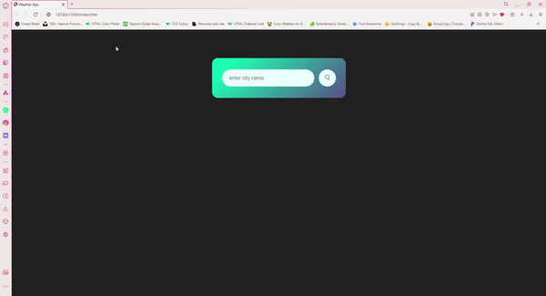

# ⛅ Live Weather App
This project is a Live Weather Application built using JavaScript, HTML, CSS, and a public Weather API. The app fetches and displays real-time weather data for any location entered by the user.

# 🔍 Features:
Real-time Weather Data: Fetches current temperature, weather conditions, and forecasts using the chosen Weather API.
Responsive Design: Fully responsive layout built with HTML and CSS, ensuring smooth user experience on all devices.
API Integration: Utilizes JavaScript to make asynchronous API calls and update the weather information dynamically without reloading the page.
User Input: Allows users to enter any city or location to retrieve the latest weather data.

# 📌 Technologies Used:
JavaScript: Handles API calls, DOM manipulation, and dynamic content updates.
HTML & CSS: Creates the structure and styling for a clean and user-friendly interface.
Weather API: Connects to a third-party service for accurate and up-to-date weather information.

# 🌞 Preview
